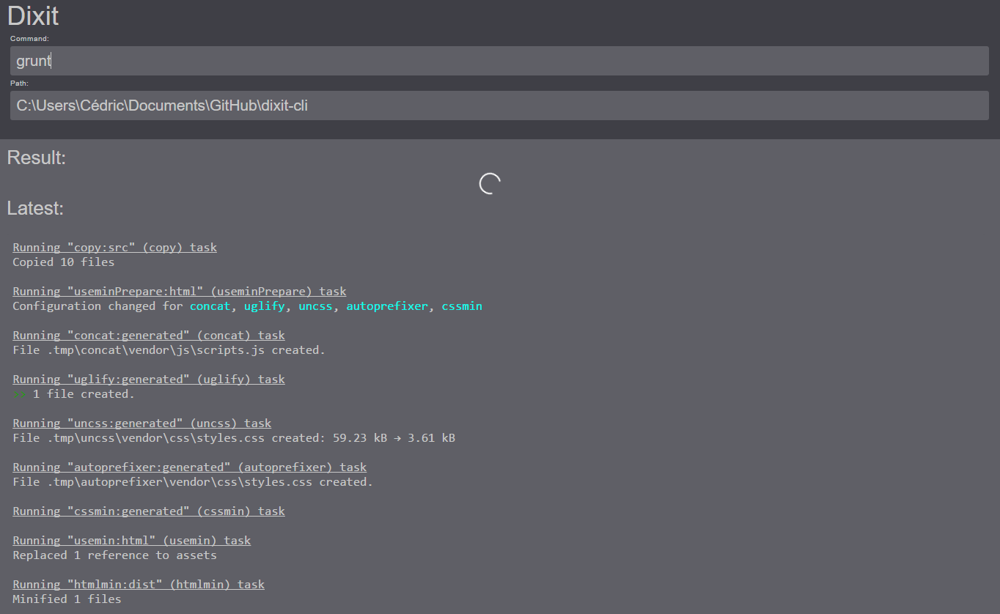

# Dixit for Desktop

Pretty  command-line interpreter.

## Installation

1. [Download for Windows](https://raw.githubusercontent.com/cedced19/dixit-desktop/master/dist/Windows.zip)
2. Extract
3. Execute `dixit-desktop.exe`



## To compile

```
npm install
gulp
```